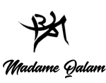

# Madame qalam

## table de matières 
[Description](#description)
[]

[Installation](#installation)

[Points D'accès de l'API] (#Points-Daccès-de-l'API)

## Description 
<p style"text-align:centre ">


texte


## Installation 

### Version
Node.js..

MySQL....

MongoDB..

React..

## Instalation 

### Docker 
Installation avec Docker 

```js
<script></script>
```
### Accéder aux conteneurs Docker 
 Avec Visual Studio Code,...
### Charger une base de données 
se connecter au conteneur MySQL avec Visual Studio Code 
```bash
 docker..
```

charger un fichier SQL
```sql
```
## Point d'accèes de l'API

### Securité

Route      | Méthode HTTP   | Description
-----------|----------------|------------
/redister  | POST           | Enregister un utilisateur 

/login     | POST           | connecter un utilisateur 

/auth      |POST            | Autoriser un utilisateur 


## Etudiant 

Route      | Méthode HTTP  |Description 
-----------|---------------|-----------
/artwork   | GET           |Lister les oeuvres
[Télecharger le cahiers de charge](...)
[Télecharger la présentation](...)